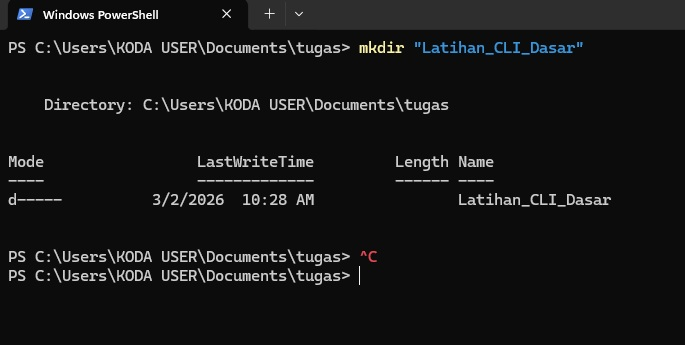
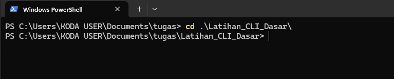
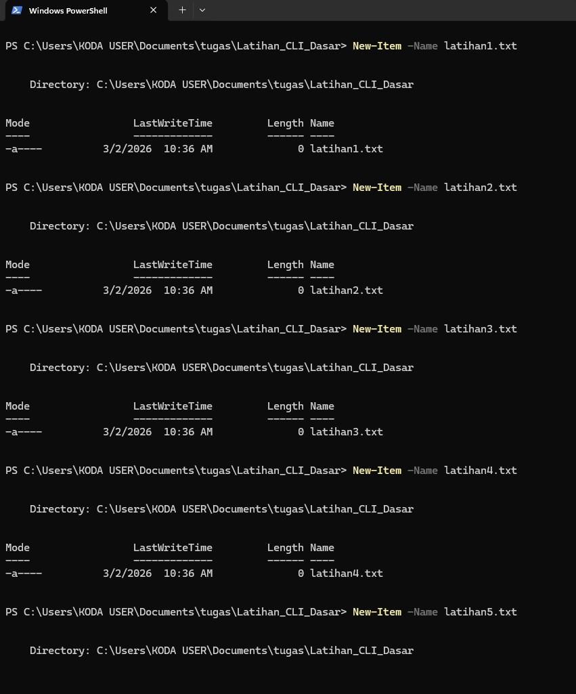
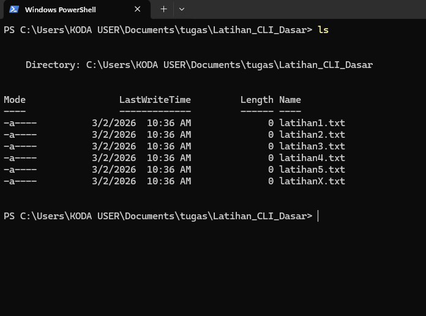
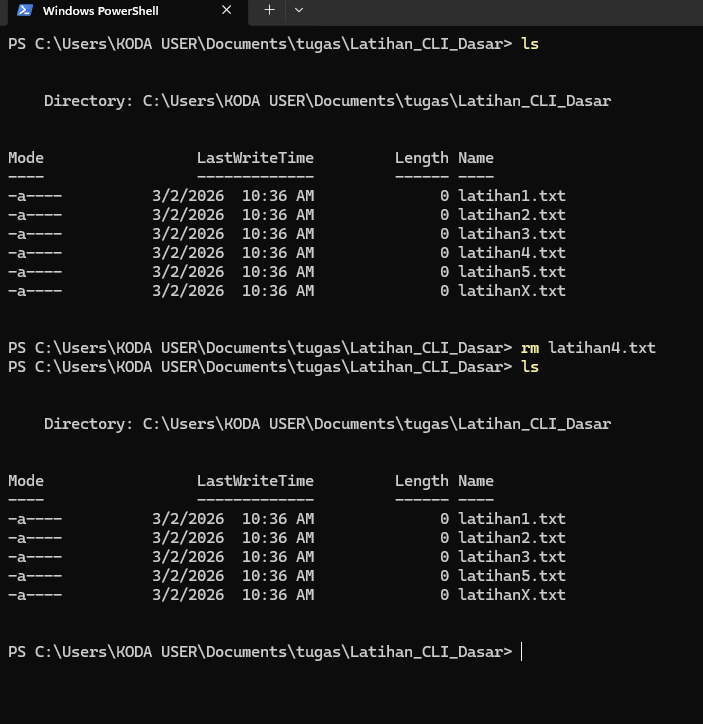
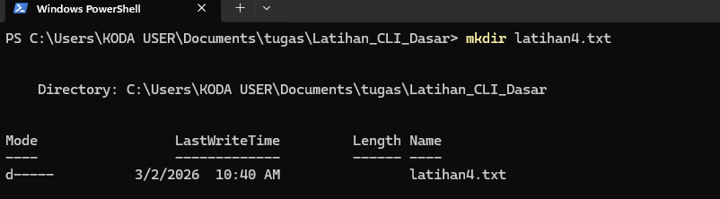
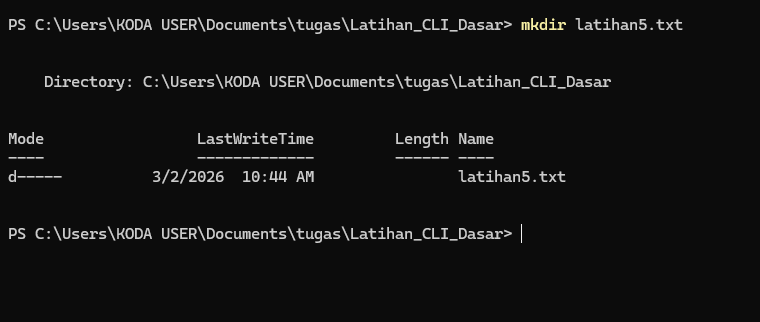
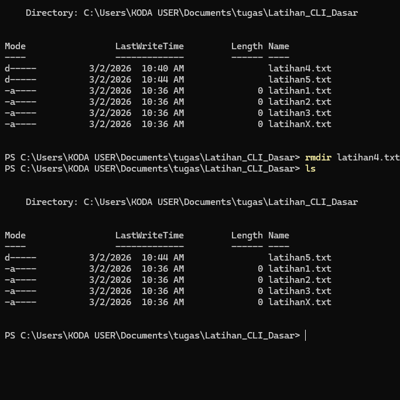

# Minitask Cli
-  mkdir(make directory) adalah Command Powershell Membuat Folder dan contoh dibawah Membuat folder baru dengan nama latihan_CLI_Dasar

- Command pindah ke folder baru kita buat tadi yaitu latihan_CLI_Dasar

- Command New-Item membuat file baru dengan nama latihanX.txt X adalah perwakilan angka 1,2,3,4,5 dari file kita buat

- Command ls atau dir untuk melihat file yang sudah kita buat tadi

- Command rm untuk menghapus file latihan4.txt

- Command mkdir untuk membuat folder baru dengan nama latihan4.txt

- Command rm untuk menghapus file latihan5.txt

- Command mkdir untuk membuat folder baru dengan nama latihan5.txt

- rmdir untuk menghapus folder latihan4.txt

# Sekian Terimakasih 😄 😸 😄